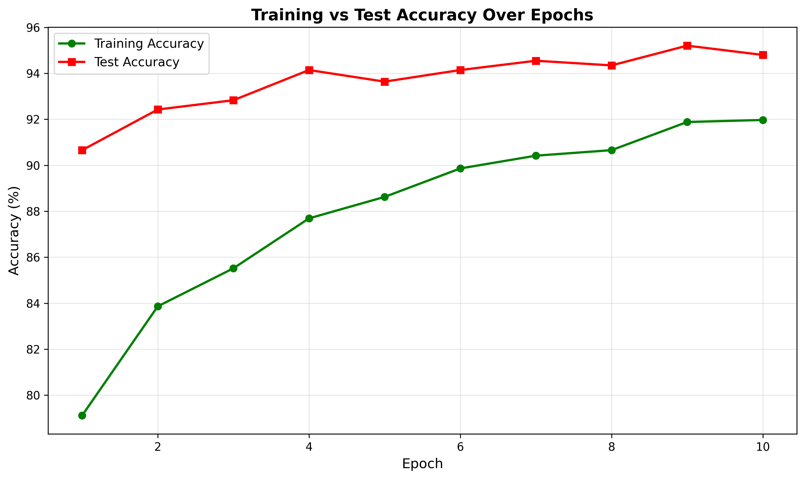
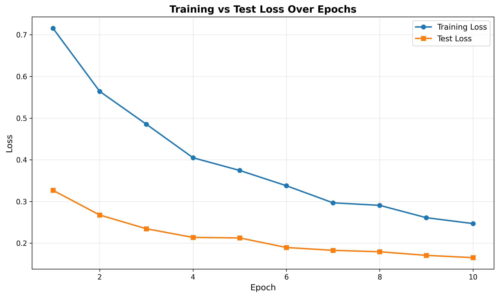

# QuickDraw CNN Image Classifier

A deep learning project for multi-class image classification using Convolutional Neural Networks (CNNs) built with **PyTorch**, trained on a subset of Google's [QuickDraw dataset](https://quickdraw.withgoogle.com/data).

---

## 🧠 Project Overview

This project implements a full deep-learning pipeline that classifies hand-drawn sketches into **100 different categories**. The model is trained on 28×28 grayscale images and achieves solid accuracy through a custom-designed CNN architecture.

The project covers everything from data loading and preprocessing to model training, evaluation, and result visualization.

---

## 📁 Project Structure

```
├── src/
│   ├── QuickDraw_CNN.ipynb   # Main notebook (training + evaluation)
│   └── model.pth             # Saved trained model weights
├── report.pdf                # Full write-up with architecture, results & analysis
└── README.md
```

---

## 🗂️ Dataset

The dataset is a curated subset of the QuickDraw dataset, organized as:

```
selected_images/
    ambulance/
    angle/
    ...  (100 classes total)
```

Each class folder contains grayscale **28×28 PNG** sketch images.

---

## ⚙️ Pipeline

The notebook (`src/QuickDraw_CNN.ipynb`) implements the following steps:

1. **Custom Dataset & DataLoader** — built using PyTorch's `Dataset` and `DataLoader` classes
2. **Train/Test Split** — 80/20 stratified split
3. **CNN Architecture** — a custom multi-layer CNN designed for 100-class classification
4. **Training Loop** — tracks loss and accuracy per epoch for both train and test sets
5. **Visualization** — plots training vs. test loss and accuracy curves
6. **Model Saving & Evaluation** — saves `model.pth` and includes reproducible evaluation code

---

## 📊 Results

| Metric         | Value     |
|----------------|-----------|
| Test Accuracy  | _94%_ |
| Optimizer      | _Adam_ |
| Learning Rate  | _0.001_ |
| Batch Size     | _64_ |
| Epochs         | _20_ |

> Training vs. test accuracy and loss curves




---

## 🚀 How to Run

1. Clone the repository:
   ```bash
   git clone https://github.com/your-username/quickdraw-cnn.git
   cd quickdraw-cnn
   ```

2. Install dependencies:
   ```bash
   pip install torch torchvision matplotlib numpy pillow
   ```

3. Add your dataset to the project root:
   ```
   selected_images/
   ```

4. Run the notebook top-to-bottom:
   ```bash
   jupyter notebook src/QuickDraw_CNN.ipynb
   ```

5. To evaluate using the saved model:
   ```python
   # Loads model.pth and computes test accuracy
   # (See the evaluation section in the notebook)
   ```

---

## 🛠️ Tech Stack

- **Python**
- **PyTorch** — model building, training, evaluation
- **Matplotlib** — loss and accuracy plots
- **NumPy / Pillow** — data preprocessing

---

## 👤 Author

**Mohammad Mahyar Esfahani**  
[LinkedIn](https://www.linkedin.com/in/mohammad-mahyar-esfahani-5671a5170/) • [GitHub](https://github.com/mahyar-e) • [mahyar137979@gmail.com](mailto:mahyar137979@gmail.com)
